<h2 align="center">🛠 Technologies and Tools 🛠</h2>

 

<!-- https://simpleicons.org/ -->

&nbsp;

&nbsp;

&nbsp;

&nbsp;

&nbsp;

&nbsp;

&nbsp;

&nbsp;

&nbsp;
 
  <h2 align="center">🔥 GitHub Stats 🔥</h2>
  

  

      

  
 
<h2 align="center">🔥 Where to find me 🔥</h2>
 
<!-- https://icons8.com -->

  
  
  
  

 
<h2 align="center">📑 My Favorites Quote 📑</h2>
 

<!--
**Lakeserl/Lakeserl** is a ✨ _special_ ✨ repository because its `README.md` (this file) appears on your GitHub profile.

Here are some ideas to get you started:

- 🔭 I’m currently working on ...
- 🌱 I’m currently learning ...
- 👯 I’m looking to collaborate on ...
- 🤔 I’m looking for help with ...
- 💬 Ask me about ...
- 📫 How to reach me: ...
- 😄 Pronouns: ...
- ⚡ Fun fact: ...
-->
